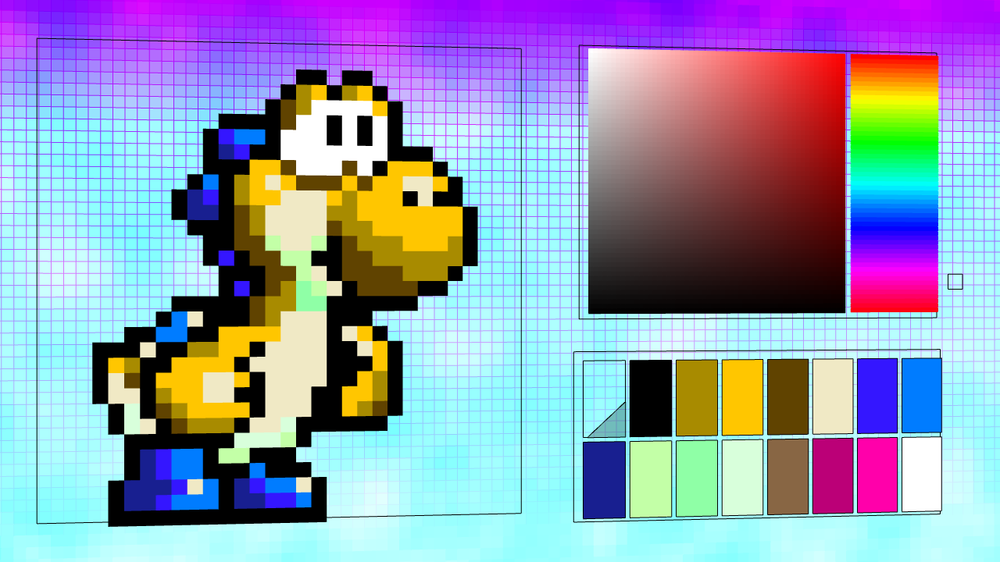

## PX-16
A unique and cool-looking pixel art editor built with Processing.  
  
Click on this image for a video demonstration.

# Concept
Built for BreadBox, a collaborative Art-Jam, the theme was Yoshi's Island.

I did this under the thought of "this would be cool to make". Conceived whilst driving up to North California a few years back.

Just a fun little art project that didn't need to be in 3D but is.

# Interesting Points

When working on this project I originally made the background. As I was thinking about what this background would look good behind, I thought Pixel Art. I discovered shortly thereafter while preparing the first draft of that that sometimes arbitrary values are fun, but usually they're not. Instead of storing an array of colors for each pixel I decided to make an array of colors (a color palette) and attach each piece of pixel data to a location in that array. Whilst doing this I established a lot of connections between this and the way that old video game consoles often held color data under limited palette constraints.

In order to figure out how to best let a user come with a color, I tried using the default OS color selector, which is pretty complex on mac computers but limited on windows computers as it more closely resembles ms paint's color selector and doesn't allow hex values. After deciding to make my own color selector, I turned to Photoshop for inspiration. I found that the default system in PS is to use the HSB color space and allow Saturation and Brightness to be determined by a location on an XY grid and have the hue selectable by a bar next to it. This became a very useful way of swapping out palettes quickly and usefully as established in the video above.

Made in 1 week for BreadBox Early 2017